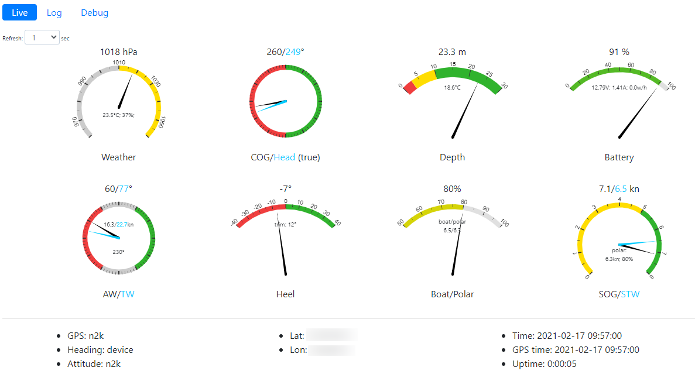
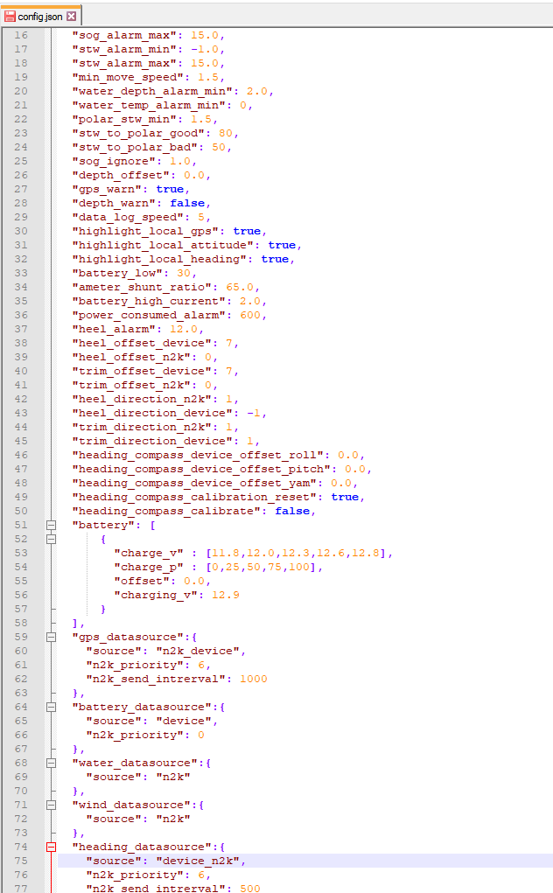

# NMEA2000 hub
Based on M5Stack it gets, sends, displays, processes and logs boat data using from N2K network and from M5stack compatible units.

Features:
----------------
* Receives data from NMEA2000 network (primary or as a fallback).
* Receives data from M5Stack compatible units (primary or as a fallback). Currently supports 
    * M5S Can Bus (or Waveshare SN65HVD230), 
    * M5S GPS, 
    * Seeedstudio Compass V2 (BMM150 based), 
    * M5S Attitude IMU, 
    * M5S Environment, 
    * M5S Voltmeter,  
    * M5S Ammeter (direct or via additional shunt),     
* Sends data from units to N2K network. E.g. GPS, battery, weather, heading, attitude.
* Processes data. E.g. calculates polars, averages, maximums/minimums, true wind, battery charge, power used etc.
* Polars custom table in json format - displays target speed based on your own data. 
* Displays all the data. Up to 32 pages and different layouts completely customizable. Auto loop through pages mode. Highlights alarming values. Pops up some simple alarms.
* Highly configurable via json configs on SD card. Displays your logo on startup (put logo_320x240.jpg|png|bmp in SD card root). Remembers state (e.g. last page and brightness).
* Data log - daily json logs with all the data on SD card in CSV.
* For developers. List of N2K messages and datasources can be easily expanded by developers. Modular OOP design. Performance log with N2K messages listing. Test mode.
* Power consumption (M5stack + units) 110mA. Can be powered even from N2K directly
* Wi-Fi web server (access point). Displays in browser near real time gauges, displays and exports log files. !!!Copy Examples/www folder to your SD card root. 
* Budget < $100
* And much more

Software: 
----------------
* M5Stack the Board Software https://docs.m5stack.com/#/en/arduino/arduino_home_page
* Libraries NMEA2000, NMEA2000_esp32 from Timo Lappalainen: https://github.com/ttlappalainen (included in this repo)
* For GPS unit library TinyGPSPlus and espsoftwareserial  from https://github.com/mikalhart/TinyGPSPlus,  https://github.com/jdollar/espsoftwareserial/ (included in this repo)
* Some other third party code included

Hardware:
----------------
* M5Stack 
* Optional units
* Optional power supply

Donate:
----------------
If you like it you can buy me a pizza
* Paypal: ilya.drv@gmail.com
* BTC: bc1qwrahpes4nans7kencysrwhkekdmz0dsq2kkfpz

Photos:
----------------
Use json file on SD card to create up to 32 pages 1-15 tiles each\

In my installation I will not use the battery but connect it straight to 5 volts.
This will switch on/off the device together with the whole navigation network\

Most of the devices connected via I2C (pin 21,22), GPS uses 16,17 and 2,35 are for CAN\

N2k network\

Your N2K power cable most probably has data wires which are not used.
You can use them and save 1 T-connector\

Web server via Wi-Fi access point\

Logs and configs\

Inspired by
----------------
* https://open-boat-projects.org/en/
* https://github.com/AK-Homberger/M5Stack-NMEA-2000-Display-CAN-BUS
